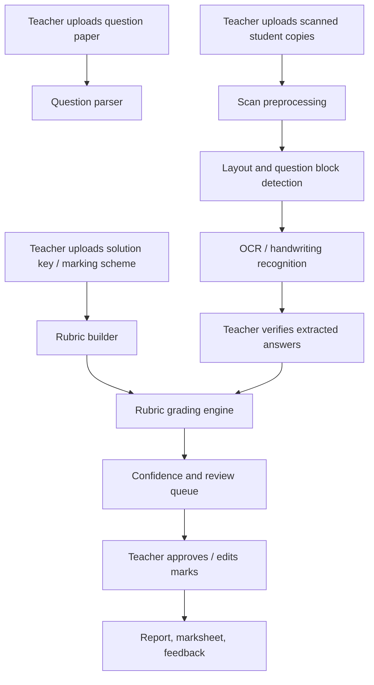

# Architecture

## System Flow

## Modules

### 1. Ingestion

Inputs:

- question paper PDF/image
- solution key PDF/image/text/JSON
- student answer copy PDF/image batch

Outputs:

- normalized page images
- extracted question text
- extracted answer key
- answer blocks by student and question

### 2. OCR Layer

OCR must be pluggable because no one engine will handle every copy.

Recommended adapters:

- `tesseract`: printed text baseline
- `paddleocr`: printed and general document OCR
- `doctr`: document OCR research-friendly path
- `trocr`: handwritten English line recognition
- `pix2text`: mixed text and formula extraction

Each OCR result should contain:

- text
- confidence
- bounding box
- page number
- image crop path
- engine name

### 3. Rubric Layer

The marking scheme should become structured data:

- question id
- maximum marks
- official answer
- value points
- accepted alternatives
- keywords
- numeric tolerance
- step marks
- required units
- common mistakes

### 4. Grading Layer

Use a hierarchy:

1. Exact matching for MCQ and one-word answers.
2. Numeric matching with tolerance.
3. Keyword/value-point checks.
4. Semantic similarity.
5. Optional local LLM rubric scoring.
6. Human review for low confidence.

Never let a language model silently override deterministic checks.

### 5. Review Layer

Teacher view should show:

- original answer crop
- OCR text
- suggested marks
- rubric items matched
- rubric items missed
- confidence
- edit controls

The review queue should sort:

1. OCR confidence low
2. score near boundary
3. model disagreement
4. answer unreadable
5. high-mark questions

### 6. Reporting

Exports:

- student-wise marksheet
- question-wise deductions
- class analytics
- common mistakes
- printable feedback
- CSV for school records

## Data Privacy

Default behavior:

- all files stay on the teacher's computer
- no external API calls
- optional local models only
- generated reports avoid unnecessary personal data

## Accuracy Strategy

The system should measure accuracy in layers:

- OCR character error rate on teacher-corrected text
- question mapping accuracy
- mark agreement with teacher
- exact agreement and within-one-mark agreement
- review time saved per copy

The first target is not 100 percent autonomous grading. The first target is to reduce teacher time while preserving teacher authority.

